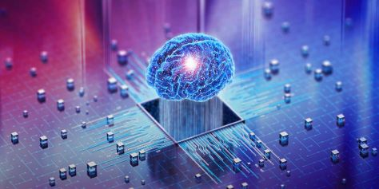

# Tarea-2
Investigación sobre Computación Cuántica, Neuromórfica, Biológica, Heterogénea y de Borde.

---

## 1 – ***COMPUTACIÓN CUANTICA***

La **computación cuántica** es un paradigma que utiliza principios de la mecánica cuántica para procesar información. A diferencia de la computación clásica que emplea bits (0 o 1), la cuántica usa **qubits**, que pueden estar en una superposición de estados. Esta propiedad permite realizar cálculos paralelos y resolver ciertos problemas de forma exponencialmente más rápida que con computadoras tradicionales.

### Arquitectura de un computador cuántico
Un computador cuántico moderno está compuesto por:
- **Qubits**: unidades de información cuántica (ej. iones atrapados, superconductores, fotones).  
- **Puertas cuánticas**: operaciones lógicas sobre qubits que manipulan sus estados.  
- **Control clásico**: hardware tradicional que controla las operaciones cuánticas.  
- **Sistema de medida**: convierte estados cuánticos en resultados clásicos.  
- **Sistema de refrigeración**: como los criostatos de dilución, que enfrían los qubits superconductores a temperaturas cercanas al cero absoluto.

### Historia
- 1️⃣9️⃣8️⃣1️⃣ – Richard Feynman plantea la idea de simular sistemas cuánticos con computadores cuánticos.
- 1️⃣9️⃣8️⃣5️⃣ – David Deutsch formula el concepto de computador cuántico universal.
- 1️⃣9️⃣9️⃣4️⃣ – Peter Shor diseña un algoritmo de factorización con ventaja exponencial.
- 1️⃣9️⃣9️⃣6️⃣ – Lov Grover propone un algoritmo de búsqueda con ventaja cuadrática.
- 2️⃣0️⃣0️⃣1️⃣ – IBM y Stanford ejecutan el algoritmo de Shor con 7 qubits NMR.
- 2️⃣0️⃣0️⃣7️⃣ – D-Wave lanza los primeros sistemas de quantum annealing.
- 2️⃣0️⃣1️⃣6️⃣ – IBM ofrece acceso en la nube a procesadores cuánticos (IBM Q).
- 2️⃣0️⃣1️⃣9️⃣ – Google anuncia “supremacía cuántica” con Sycamore de 53 qubits.
- 2️⃣0️⃣2️⃣0️⃣ – Avances en superconductores, iones atrapados y qubits topológicos.  
- Actualidad: empresas como IBM, Google y D-Wave han desarrollado procesadores cuánticos funcionales.

### Ventajas
- Resolución de problemas intratables para computadoras clásicas (simulación de moléculas, criptografía).  
- Gran paralelismo en cálculos matemáticos complejos.  
- Posibilidad de revolucionar campos como inteligencia artificial, logística y medicina.

### Desventajas
- **Decoherencia cuántica**: los qubits pierden información rápidamente por interacción con el entorno.  
- Necesidad de **corrección de errores cuánticos**.  
- Costos altos y dependencia de infraestructuras complejas.  
- Aún en fase experimental, sin aplicaciones masivas disponibles.

### Principios clave
- **Superposición**: un qubit puede representar 0 y 1 al mismo tiempo.  
- **Entrelazamiento**: dos o más qubits se correlacionan de forma que el estado de uno depende del otro.  
- **Interferencia cuántica**: combinación de probabilidades que refuerzan o cancelan resultados.  
- **Medición probabilística**: los resultados se obtienen con ciertas probabilidades, no certezas absolutas.

---

## 2 – ***COMPUTACIÓN NEUROMORFICA***

La **computación neuromórfica** busca imitar el funcionamiento del cerebro humano mediante hardware especializado. Se basa en **redes neuronales de picos (SNN, Spiking Neural Networks)**, donde las neuronas disparan impulsos eléctricos solo cuando alcanzan un umbral, lo que reduce consumo energético.

### Arquitectura y funcionamiento
- **Neuronas artificiales**: procesan impulsos eléctricos simulando neuronas biológicas.  
- **Sinapsis artificiales**: conexiones entre neuronas con pesos que determinan la fuerza de transmisión.  
- **Memristores**: dispositivos que recuerdan la cantidad de corriente que pasó, útiles como sinapsis físicas.  
- **Procesamiento paralelo masivo**: similar al cerebro humano.  

Ejemplos:
- **IBM TrueNorth**: chip con un millón de neuronas y 256 millones de sinapsis.  
- **Intel Loihi**: procesador que integra aprendizaje en tiempo real con consumo energético ultrabajo.
- 
### Historia
- 1️⃣9️⃣4️⃣3️⃣ – McCulloch y Pitts proponen el modelo matemático de neurona artificial.
- 1️⃣9️⃣8️⃣0️⃣ – Carver Mead acuña el término neuromorphic computing.
- 1️⃣9️⃣9️⃣0️⃣ – Se desarrollan sensores neuromórficos iniciales.
- 2️⃣0️⃣0️⃣0️⃣ – IBM lanza el proyecto SyNAPSE.
- 2️⃣0️⃣1️⃣4️⃣ – IBM presenta TrueNorth con 1 millón de neuronas.
- 2️⃣0️⃣1️⃣7️⃣ – Intel lanza Loihi, chip neuromórfico con aprendizaje en chip.
- 2️⃣0️⃣2️⃣1️⃣ – Intel anuncia Loihi 2, con más escalabilidad y eficiencia.

### Ventajas
- Consumo energético muy bajo.  
- Ideal para procesar señales sensoriales en tiempo real (visión, voz, robótica).  
- Alta escalabilidad biológica.  

### Desventajas
- Aún en investigación, sin estandarización.  
- Dificultades en programar algoritmos adecuados.  
- Menor flexibilidad que arquitecturas clásicas.

---

## 3 – ***COMPUTACIÓN BIOLOGICA***

La **computación biológica** utiliza organismos vivos o biomoléculas como ADN, ARN o proteínas para realizar operaciones lógicas. Se apoya en procesos bioquímicos para resolver problemas de forma paralela.

### Historia
- 1️⃣9️⃣4️⃣0️⃣–1️⃣9️⃣6️⃣0️⃣ – Norbert Wiener desarrolla la cibernética y abre el camino.
- 1️⃣9️⃣9️⃣4️⃣ – Leonard Adleman resuelve un problema matemático con ADN.
- 2️⃣0️⃣0️⃣0️⃣s – Surgen puertas lógicas y circuitos sintéticos en células.
- 2️⃣0️⃣1️⃣2️⃣ – Harvard almacena un libro en ADN.
- 2️⃣0️⃣1️⃣6️⃣ – Se guardan 200 MB de datos en moléculas de ADN.
- 2️⃣0️⃣2️⃣0️⃣s – Avances en archivado de datos y biocomputación intracelular.

### Tipos de ordenadores biológicos
- **Computación con ADN**: cadenas de ADN que codifican información y realizan operaciones lógicas.  
- **Computación con ARN**: aprovechamiento de plegamiento y regulación genética.  
- **Organoides cerebrales**: mini-cerebros cultivados en laboratorio para simular procesos cognitivos.  

### Ventajas
- Paralelismo masivo a nivel molecular.  
- Alta densidad de almacenamiento de datos (1 gramo de ADN puede almacenar terabytes).  
- Posible integración con biotecnología y medicina.

### Desventajas
- Lentitud comparada con sistemas electrónicos.  
- Dificultades para la escalabilidad industrial.  
- Retos éticos en el caso de organoides y sistemas vivos.

---

## 4 – ***COMPUTACIÓN HETEROGÉNEA***

La **computación heterogénea** combina diferentes tipos de procesadores (CPU, GPU, FPGA, ASIC) para aprovechar sus ventajas en tareas específicas.

Computacionheterogenea.jpg
### Historia
- 1️⃣9️⃣7️⃣0️⃣–1️⃣9️⃣8️⃣0️⃣ – Surgen coprocesadores matemáticos y DSPs.
- 1️⃣9️⃣9️⃣0️⃣ – GPUs comienzan a usarse para simulaciones no gráficas.
- 2️⃣0️⃣0️⃣1️⃣ – NVIDIA lanza CUDA, facilitando GPGPU.
- 2️⃣0️⃣0️⃣0️⃣ – Expansión de FPGAs en telecomunicaciones e industria.
- 2️⃣0️⃣1️⃣0️⃣ – Google crea TPU, ARM desarrolla big.LITTLE.
- 2️⃣0️⃣2️⃣0️⃣ – Centros de datos combinan CPU+GPU+NPU para IA y HPC.

### Ventajas
- Uso eficiente de recursos: cada tarea corre en el procesador más adecuado.  
- Mayor rendimiento en aplicaciones intensivas como IA, simulaciones físicas y análisis de datos.  
- Flexibilidad para diferentes escenarios.

### Desventajas
- Complejidad en programación y optimización.  
- Mayor costo de desarrollo.  
- Dificultades en portabilidad del software.

Ejemplo: combinación CPU+GPU en supercomputadora Summit (IBM + NVIDIA).

---

## 5 – ***COMPUTACIÓN DE BORDE (Edge Computing)***

La **computación de borde** consiste en llevar el procesamiento de datos más cerca del lugar donde se generan, en lugar de enviarlos siempre a la nube. Esto reduce la latencia y mejora la eficiencia.

### Funcionamiento
- Los datos se procesan en dispositivos locales (routers, gateways, sensores inteligentes).  
- Solo la información relevante o procesada se envía a la nube.  
- Se aplica en IoT, vehículos autónomos y sistemas de vigilancia.

### Historia
- 1️⃣9️⃣9️⃣0️⃣– Modelo cliente-servidor, sin edge formal.
- 2️⃣0️⃣0️⃣0️⃣– Surgen CDN para acelerar contenido.
- 2️⃣0️⃣1️⃣2️⃣– Cisco introduce Fog Computing.
- 2️⃣0️⃣1️⃣5️⃣–2️⃣0️⃣1️⃣8️⃣ – Auge de IoT evidencia límites de la nube.
- 2️⃣0️⃣1️⃣8️⃣–2️⃣0️⃣2️⃣0️⃣ – 5G impulsa aplicaciones edge (vehículos autónomos, AR/VR).
- 2️⃣0️⃣2️⃣0️⃣– AWS, Azure y Google Cloud despliegan cloud-edge.  

### Ventajas
- Baja latencia en aplicaciones críticas.  
- Reducción del ancho de banda.  
- Mayor privacidad y seguridad local de los datos.

### Desventajas
- Desafíos en la seguridad de dispositivos distribuidos.  
- Necesidad de mantenimiento en múltiples nodos.  
- Menor capacidad de cómputo que la nube centralizada.

Ejemplo: sistemas de conducción autónoma que procesan datos en tiempo real para tomar decisiones inmediatas.

---

## REFERENCIAS

- Nielsen, M. A., & Chuang, I. L. (2010). *Quantum Computation and Quantum Information*. Cambridge University Press.  
- IBM Quantum. (2024). *What is quantum computing?*. IBM Research.  
- Intel Labs. (2023). *Neuromorphic Computing: Loihi 2*.  
- IBM Research. (2014). *TrueNorth: neuromorphic CMOS chip*.  
- Adleman, L. (1994). *Molecular computation of solutions to combinatorial problems*. Science.  
- Marr, B. (2021). *A Short History of DNA Computing*. Forbes.  
- Hennessy, J. & Patterson, D. (2017). *Computer Architecture: A Quantitative Approach*. Morgan Kaufmann.  
- Satyanarayanan, M. (
